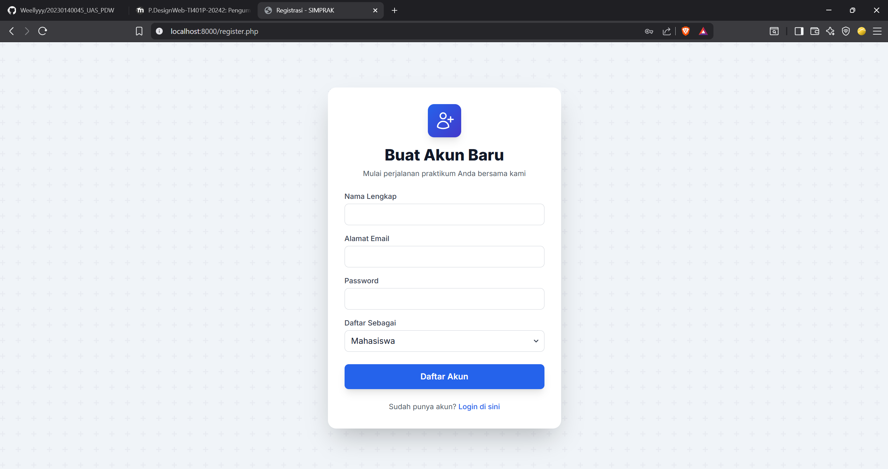
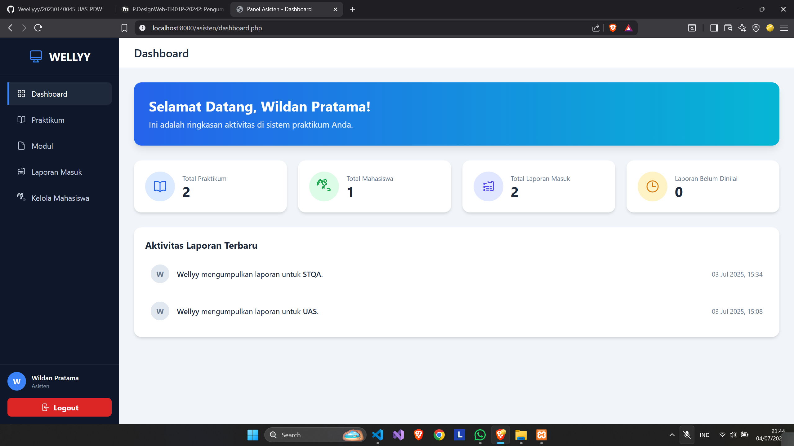
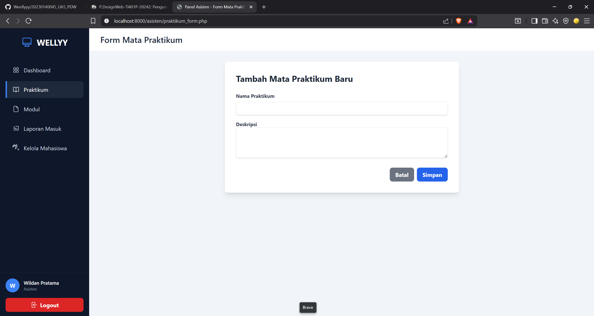
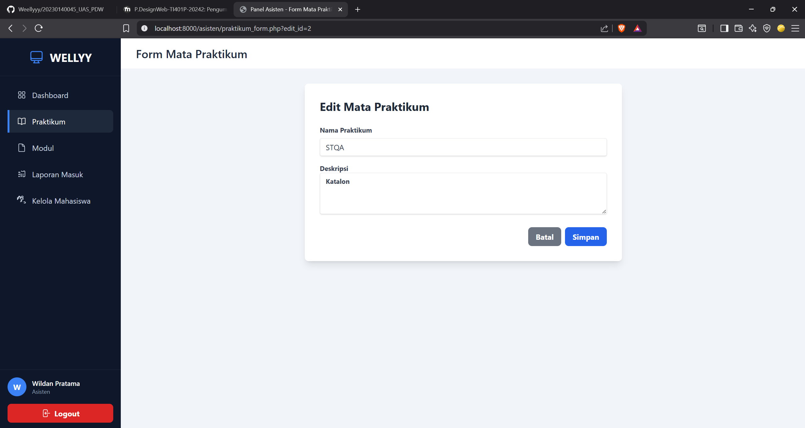
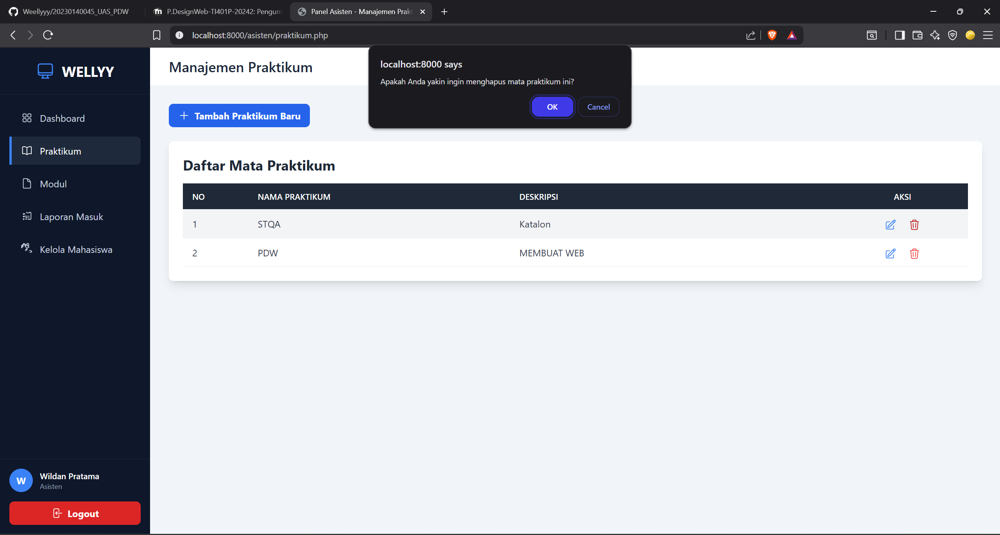
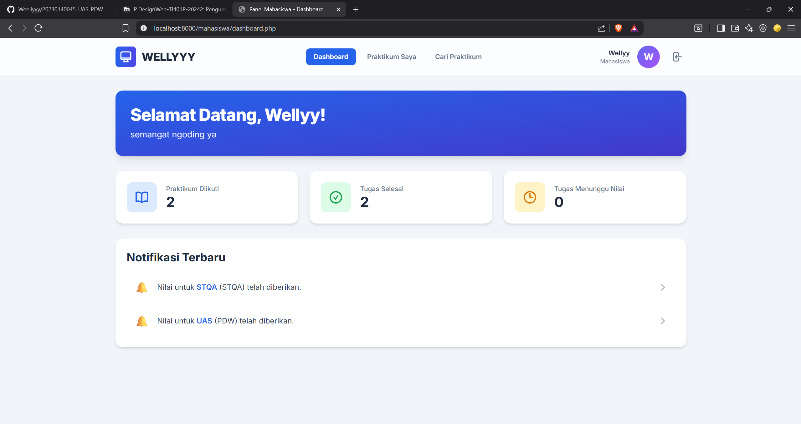
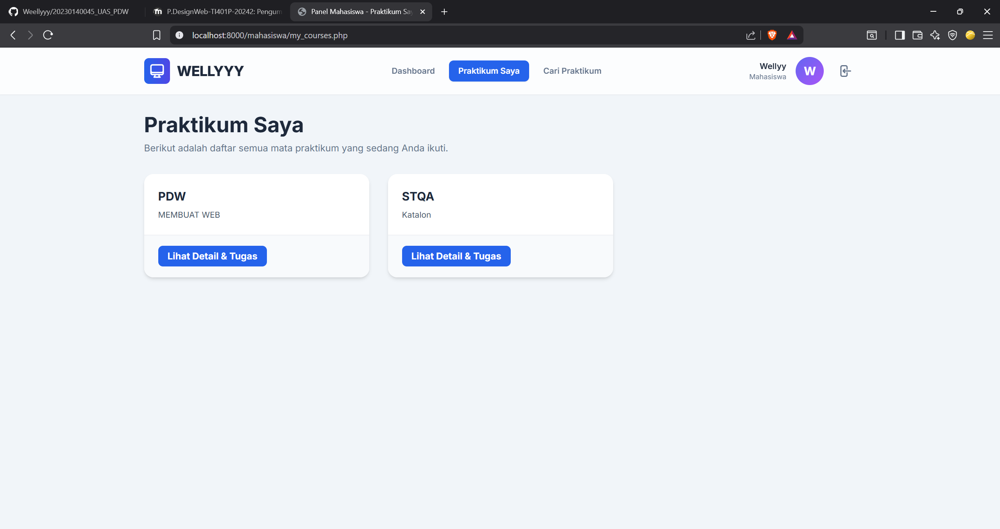
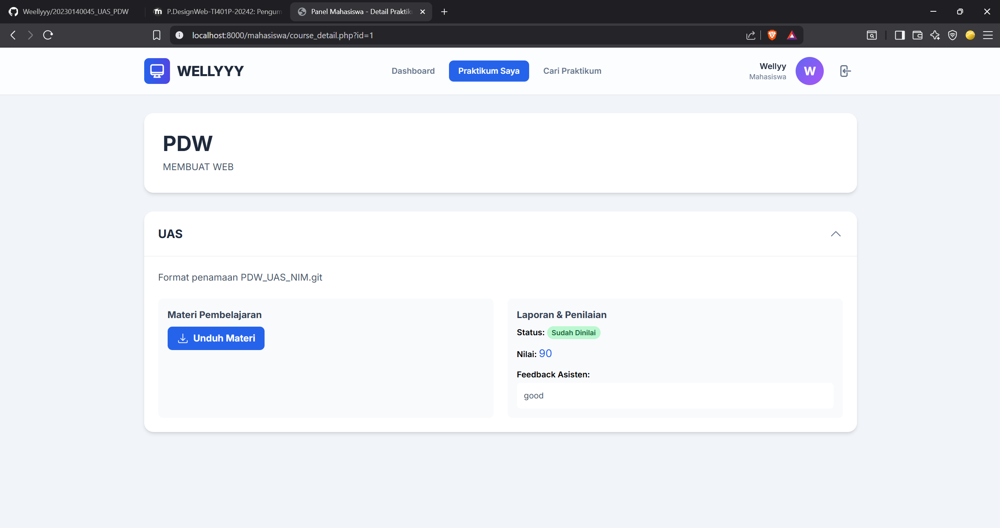
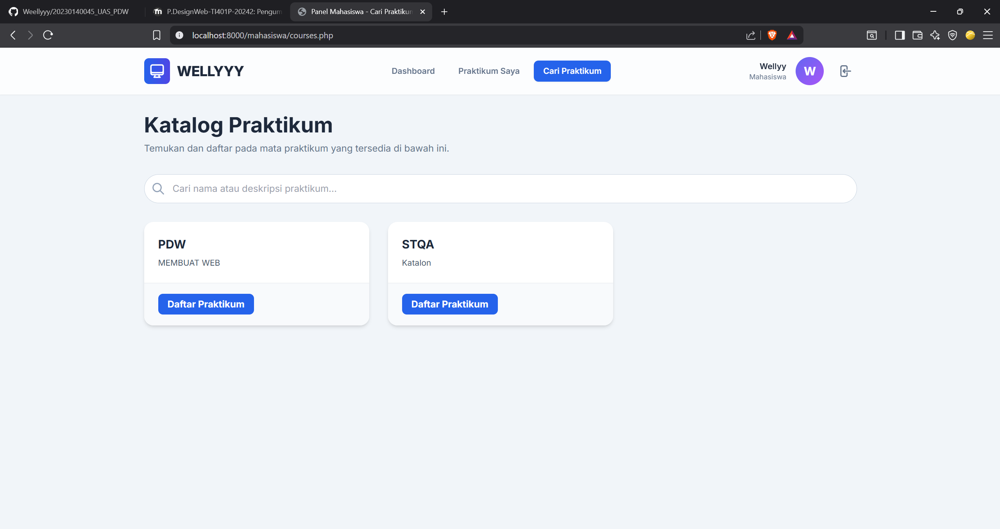

halaman login

halaman register

halaman manajemen praktikum

form tambah praktikum

form edit praktikum

fitur hapus praktikum

halaman manajemen moduk

form tambah modul

form edit modul

fitur hapus modul

halaman laporan masuk

asisten menilai laporan mhs

halaman manajemen mhs

form tambah mahasiswa

form edit mahasiswa

fitur hapus mahasiswa

dashboard mahasiswa

halaman praktikum mahasiswa

detail praktikum

pengumpulan laporan

cari praktikum

